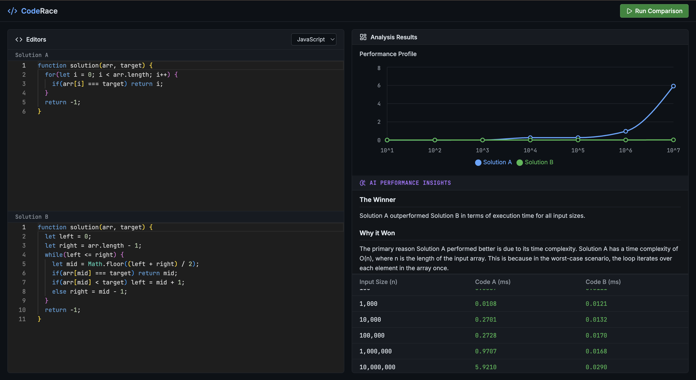

# CodeRace 🏁

CodeRace is a high-performance, multi-language developer tool for benchmarking algorithmic time complexity. Built with a premium IDE-grade interface, it allows developers to write two solutions to a problem, benchmark them across exponentially growing input sizes, and receive an AI-powered analysis of their performance.

Live: https://coderace-w49o.onrender.com/



## ✨ Features

- **Multi-Language Support**: Write and benchmark code natively in **JavaScript (Node.js), Python, Java, and C++**.
- **Interactive IDE Environment**: Features Monaco Editor integrations with standard IDE syntax highlighting, auto-formatting, and intelligent language switching.
- **Dynamic Benchmarking**: Automatically scales input sizes from $10^1$ to $10^7$ array elements and measures precise execution times.
- **Data Visualization**: Real-time rendering of performance graphs using Recharts, allowing you to instantly visualize $O(N)$ vs $O(N^2)$ vs $O(\log N)$ behaviors.
- **AI Performance Insights**: Integrates with Hugging Face Inference API (Meta-Llama/Mistral) to automatically analyze both code snippets and the resulting execution times, explaining *why* one algorithm outperformed the other based on Big O notation.
- **Production-Ready UI**: Designed with a highly professional, dark-themed, and responsive dashboard layout (40/30/30 flexbox splits) ensuring all data and insights are always accessible.

## 🛠️ Technology Stack

- **Frontend**: React.js, Vite, Recharts, Lucide Icons, React Markdown
- **Editor**: `@monaco-editor/react`
- **Backend**: Express.js (Node.js) for localized multi-language compilation and execution
- **AI Integration**: Hugging Face Open Router API
- **Containerization**: Docker

## 🚀 Getting Started (Local Development)

### Prerequisites

To run this project locally with full multi-language support, you must have the following installed on your machine:
- [Node.js](https://nodejs.org/) (v18+)
- [Python 3](https://www.python.org/)
- [G++](https://gcc.gnu.org/) (for C++ compilation)
- [Java Development Kit (JDK)](https://www.oracle.com/java/technologies/downloads/) (v11+)

### Installation

1. **Clone the repository**
   ```bash
   git clone https://github.com/yourusername/coderace.git
   cd coderace
   ```

2. **Install Dependencies**
   ```bash
   npm install
   ```

3. **Configure Environment Variables**
   Open the `.env` file in the root directory and add your Hugging Face API key for the AI Insights feature:
   ```env
   VITE_HF_API_KEY="your_huggingface_token_here"
   ```

4. **Start the Application**
   You need to run both the execution backend and the Vite frontend:
   
   *Terminal 1 (Backend Execution API):*
   ```bash
   node server.js
   ```
   
   *Terminal 2 (Frontend UI):*
   ```bash
   npm run dev
   ```

## 🐳 Deployment (Docker / Render)

CodeRace is fully containerized and ready to be deployed as a single web service. The included `Dockerfile` automatically provisions an Ubuntu image with Node, Python, C++, and Java installed.

**Deploying to Render.com (Recommended):**
1. Push this repository to GitHub.
2. Create a new **Web Service** on Render and connect your repository.
3. Render will automatically detect the `Dockerfile` and build the environment.
4. Add `VITE_HF_API_KEY` to your Render Environment Variables.
5. Deploy! The Express backend will automatically serve the compiled React frontend.

## 🛡️ Architecture & Security Note

CodeRace executes user-provided code dynamically. The current backend utilizes `child_process.exec()` to compile and run files locally. 

> **Warning**: While this repository is configured via Docker for safe localized/academic usage, exposing this backend directly to public traffic without a rigid Sandbox (like Firecracker VMs or heavily restricted namespaces) poses a Remote Code Execution (RCE) risk. Ensure proper isolation protocols if modifying this for public enterprise usage.

## 🤝 Contributing

Contributions, issues, and feature requests are welcome! Feel free to check the issues page if you want to contribute.

## 📝 License

This project is licensed under the MIT License.
